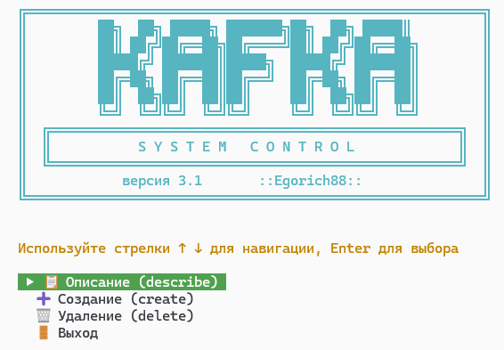
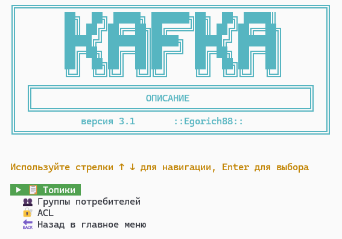
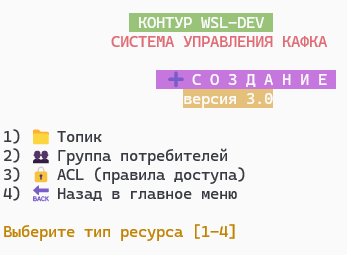
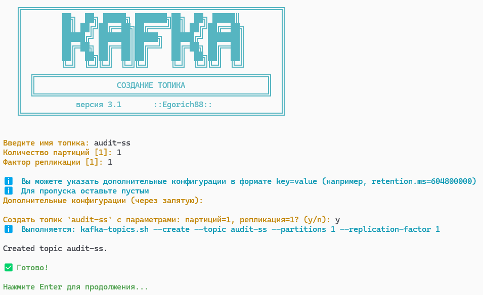
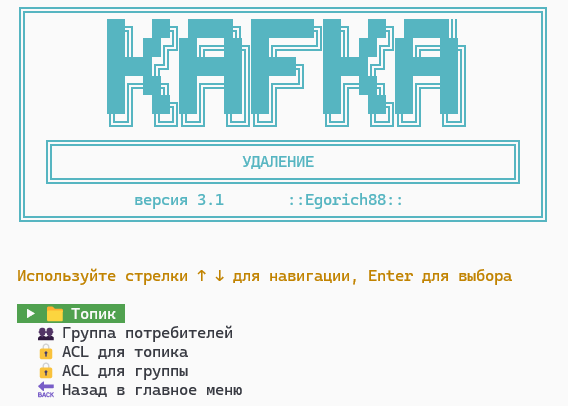
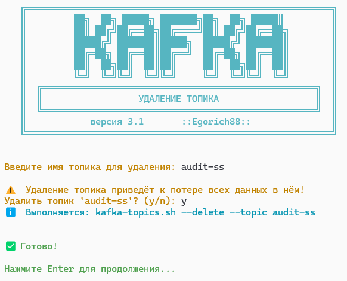

# Kafka System Control


**Версия 3.0** | Разработано [Egorich88](https://github.com/Egorich88) (2023–2026)

Комплексная система управления Apache Kafka с удобным интерфейсом командной строки на Bash.  
Проект позволяет выполнять основные операции с Kafka (просмотр, создание, удаление) через интуитивно понятное меню, автоматизирует рутинные действия и минимизирует риск ошибок благодаря подтверждениям в опасных операциях.

---

## ✨ Возможности

- 📋 **Просмотр (describe)** – информация о топиках, группах потребителей, ACL и конфигурациях.
- 🔎 **Расширенный поиск сообщений** – по оффсету (через встроенные утилиты Kafka) и по ключу (через собственную Java-программу).
- ➕ **Создание (create)** – создание топиков, ACL (с интерактивным вводом параметров).
- 🗑️ **Удаление (delete)** – удаление топиков, групп потребителей и ACL (по топику или группе) с подтверждением.
- 🔄 **Управление оффсетами (reset)** – сброс оффсетов для группы потребителей: на начало, конец, сдвиг, дату или конкретный оффсет, с предварительным просмотром (`--dry-run`).
- 🔐 **ACL** – полноценное управление списками доступа (добавление и удаление правил Allow/Deny, выбор ресурсов, операций).
- 🎮 **Удобная навигация** – все меню поддерживают управление стрелками ↑ ↓, подсветку выбранного пункта и выход по клавише `q`.
- 🖼️ **Единый стиль** – все экраны оформлены в ретро-стиле Dendy с ASCII-логотипом и названием текущего раздела.
- 📁 **Модульная архитектура** – легко добавлять новые команды и расширять функциональность.
- 📝 **Логирование** – все операции записываются в лог-файл для аудита.
- 🐧 **Поддержка WSL и Linux** – проект разработан и протестирован в среде WSL (Ubuntu) с локальной Kafka.
---

## 📁 Структура проекта


---

## ⚙️ Установка и настройка

### Требования
- **Linux** или **WSL** (рекомендуется Ubuntu)
- **Apache Kafka** (установленная и настроенная, например, в `~/kafka`)
- **Java 11+** (для работы Kafka)
- **Bash 4+**
- **Maven** (только для пересборки Java-утилиты, опционально)
  
### Шаги
1. **Клонируйте репозиторий** (или скопируйте файлы вручную):
   ```bash
   HTTPS: git clone https://github.com/Egorich88/kafka-system-control.git
   SSH: git@github.com:Egorich88/Kafka-System-Control.git
   cd kafka-system-control

2. **Настройте конфигурацию** в scripts/lib/config.sh:
   ```bash
   export KAFKA_HOME="/home/ваш_пользователь/kafka"   # путь к директории Kafka
   export BOOTSTRAP_SERVERS="localhost:9092"           # адрес брокера

4. **Убедитесь, что Kafka запущена** (ZooKeeper + брокер):
   ```bash
   jps   # должны быть QuorumPeerMain и Kafka

6. **Запустите проект:**
   ```bash
   ./main_menu.sh

---

## Сборка Java-утилиты для поиска по ключу (опционально)
Готовый JAR-файл уже находится в папке java/lib/ – вы можете сразу пользоваться функцией поиска по ключу.

Если вы хотите внести изменения в исходный код или пересобрать утилиту под другую версию Kafka:
1. Перейдите в папку java:
    ```bash
   cd java

2. Соберите проект с помощью Maven:
    ```bash
   mvn clean package
   
3. Скопируйте полученный JAR в lib/:
    ```bash
   cp target/kafka-search.jar lib/
---

## 🚀 Использование
После запуска отображается главное меню с пунктами:
   1) 📋 Описание (describe)
   2) ➕ Создание (create)
   3) 🗑️ Удаление (delete)
   4) 🚪 Выход



---

## 🎮 Навигация 
- Используйте стрелки вверх/вниз для перемещения по пунктам меню.
- Enter – выбрать пункт.
- q – выйти из текущего меню или программы.

Все меню (главное, топики, группы, ACL, поиск) оформлены в едином стиле с ASCII-логотипом и названием раздела.

---

## 📋 Описание (describe)
- Внутри модуля доступны подменю:

- Топики – поиск, конфигурация, список.

- Группы потребителей – поиск, список, состояние всех групп.

- ACL – просмотр прав на топик или полного списка.
🔎 Поиск сообщений
В меню «Топики» → «Поиск сообщения» доступны два режима:

- По оффсету – введите название топика, номер партиции и оффсет. Будет показано одно сообщение (используется встроенный kafka-console-consumer).

- По ключу – введите топик и ключ сообщения. Java-утилита просканирует все партиции и выведет найденные сообщения (ключ должен совпадать точно).



---

## ➕ Создание (create)
- Топик – интерактивное создание с указанием партиций, фактора репликации и дополнительных конфигураций.

- ACL – гибкое создание правил доступа:

   -Тип разрешения (Allow/Deny)

   - Principal (например, User:alice)

   - Хост (IP или *)

   - Тип ресурса (Topic, Group, Cluster, TransactionalId, DelegationToken)

   - Операции (Read, Write, Create, Delete, Alter, Describe, ClusterAction, All)

- Группа потребителей – пока информационная заглушка.



Создаем топик:




---

## 🗑️ Удаление (delete)
- Модуль поддерживает удаление следующих ресурсов:

- Топик – полное удаление топика (с подтверждением).

- Группа потребителей – удаление группы потребителей.

- ACL для топика – удаление всех правил ACL, связанных с указанным топиком.

- ACL для группы – удаление всех правил ACL, связанных с указанной группой потребителей.

Все операции требуют подтверждения для предотвращения случайных удалений.



Удаление топика



---

## 🔧 Расширение функциональности
Проект построен модульно. Чтобы добавить новую команду:

1. Создайте файл модуля в scripts/modules/.

2. Используйте общие библиотеки (lib/*.sh).

3. Добавьте вызов модуля в main_menu.sh.

Для добавления новых Java-утилит создавайте классы в java/src/main/java/ru/egorich88/kafka/, обновляйте pom.xml и интегрируйте вызов в соответствующий bash-скрипт.


---

## 📌 Примечания
- Если вы не настраивали авторизацию в Kafka, команды ACL будут сохраняться в ZooKeeper, но не применяться. Для включения авторизации см. документацию Kafka.

- Все действия логируются в файл logs/kafka_operations.log.

---

## 🤝 Автор Egorich88
Проект создан в 2023–2026 годах для автоматизации работы с Kafka.
«Movement – life!»

---

## 📄 Лицензия
Проект распространяется под лицензией MIT. Подробнее в файле LICENSE.

## 📈 Планы развития
*   [x] Модуль описания (describe) с поиском по оффсету и ключу

*   [x] Модуль создания (create) с поддержкой ACL

*   [x] Модуль удаления (delete)

*   [x] Управление стрелками и единый стиль интерфейса

*   [x] Java-утилиты для расширенного поиска сообщений

*   [ ] Веб-интерфейс (React + Go)

*   [ ] Поддержка нескольких окружений (DEV, PREPROD, PROD)

*   [ ] Интеграция с Prometheus/Grafana

*   [ ] Управление оффсетами групп (сброс на начало/конец/по времени)

### 🤝 Как помочь проекту
*   Поставьте звезду на GitHub.
*   Предложите улучшения через Issues или Pull Requests.
*   Сообщите об ошибках.

---

**© 2026 | Kafka System Control [Egorich88](https://github.com/Egorich88)** 🇷🇺


